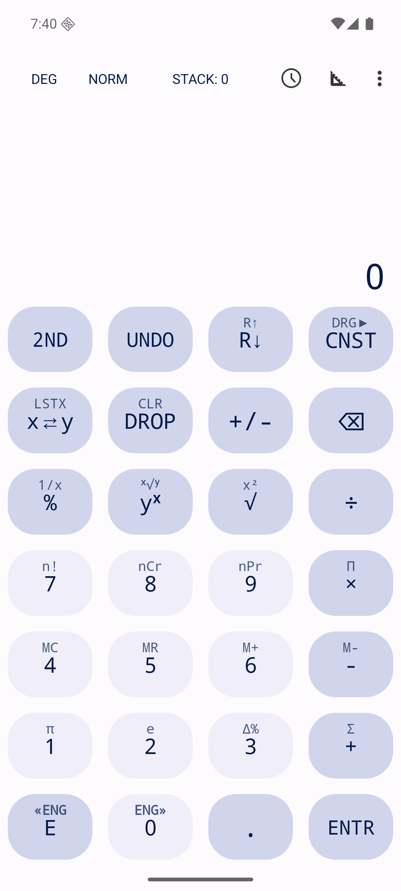
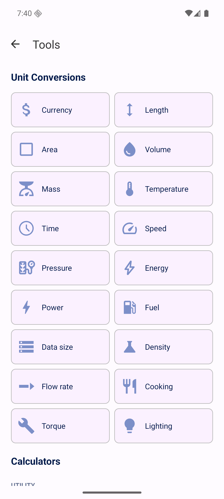

# RPN Calculator

An RPN (Reverse Polish Notation) scientific calculator for Android, forked from
[FossifyOrg/Calculator](https://github.com/FossifyOrg/Calculator) and rebuilt around a stack-based
entry model instead of infix expressions.

<p float="left">
  
  
</p>

## Note on permissions
The application will ask for the networking permission. Networking is needed only for updating currency exchange rates, and rates will never be refreshed without explicit user input. Updated rates are stored persistently for offline use. Disabling the networking permission will not impede any other function of the application.

## Features

- RPN (postfix) entry mode
- Scientific functions
- Useful constants
- Conversions for common units and currency
- Formulae for common calculations

## Installing

Releases are published as signed APKs on the [Releases page](../../releases), tracked via
[Obtainium](https://github.com/ImranR98/Obtainium):

1. In Obtainium, tap **Add App**.
2. Paste this repo's URL: `https://github.com/kvvba/android-rpn`.
3. Obtainium will pick up new versions automatically whenever a release is published here.

## Building

```
./gradlew assembleDebug
```

The debug APK is written to `app/build/outputs/apk/debug/`.

## License

GPLv3 — see [LICENSE](LICENSE). Based on [FossifyOrg/Calculator](https://github.com/FossifyOrg/Calculator).
